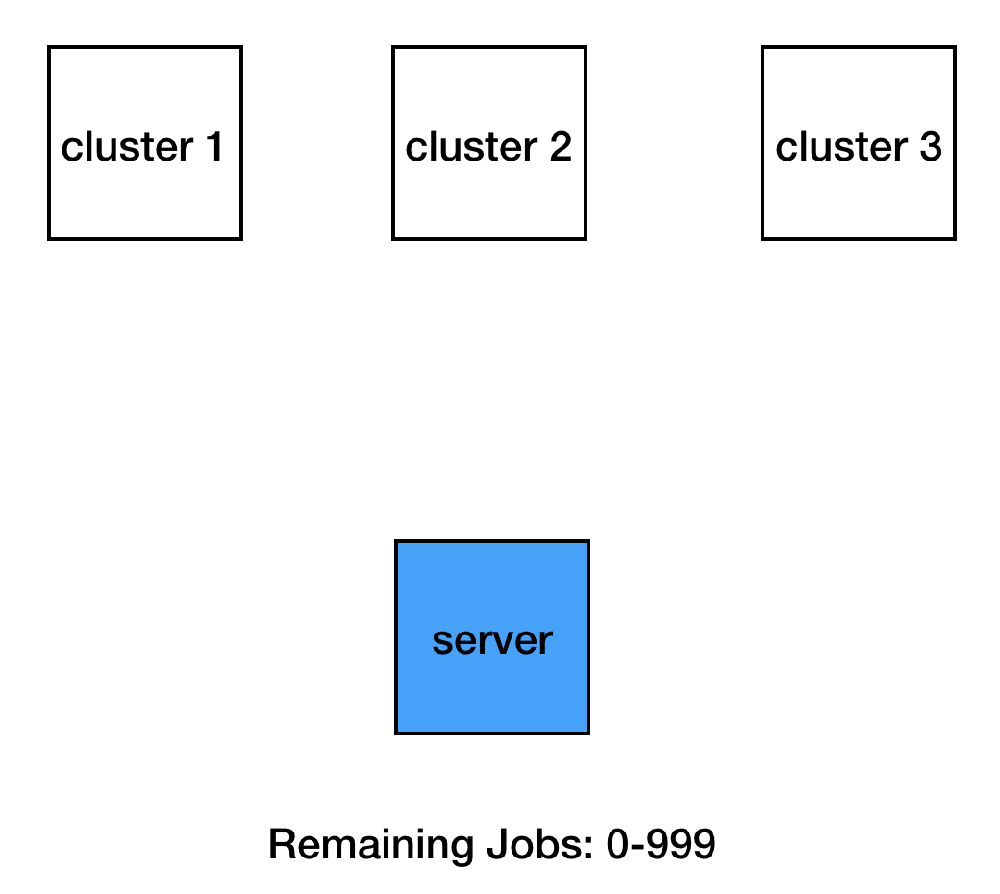
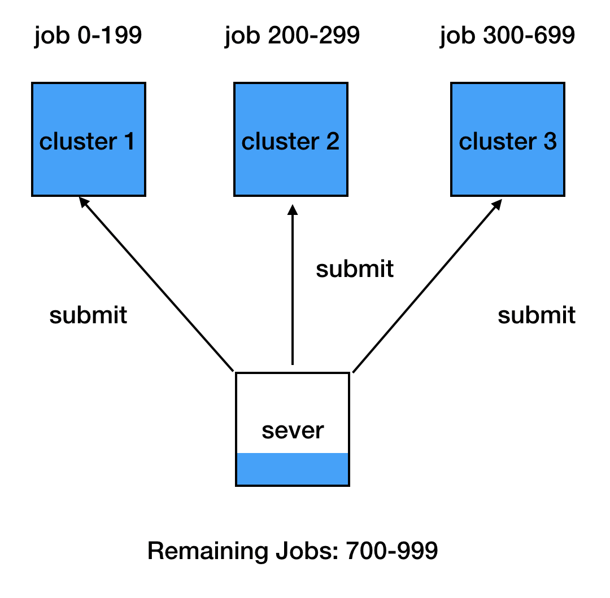
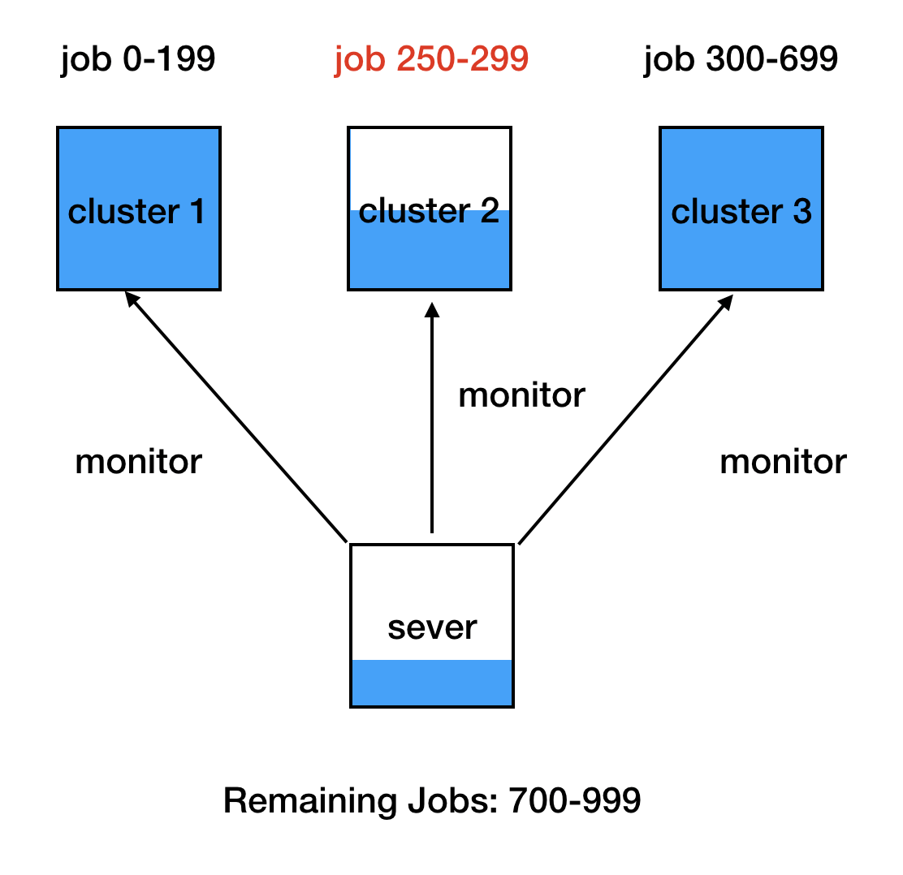
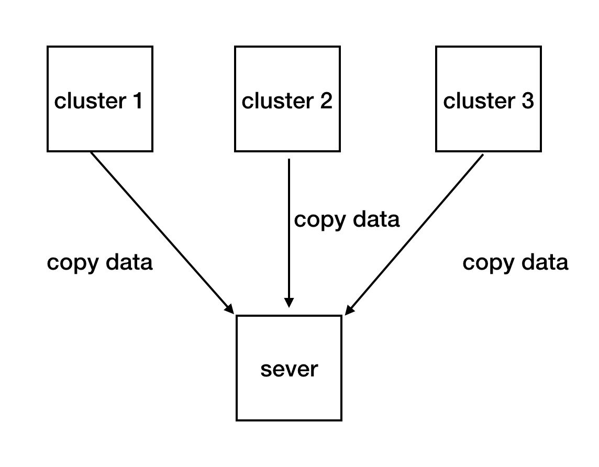

<p></p>

AlphaEx (Alpha Experiment) is a python toolkit that helps you manage large number of experiments easily and efficiently.

With AlphaEx, you can:
1. Run multiple experiments on multiple computer clusters automatically.
2. Sweep over experimental variables in a simple efficient way -- just define a json file and do all sweeps with one click.

The above 2 functions are implemented in 2 self-contained python scripts
`submitter.py`, `sweeper.py`.

**Warning**:

Sweeper can be used in any machine with python 3 installed. But submitter is only compatible with **slurm**.
Make sure you have access to at least one cluster with slurm installed. For example, I
have an account on compute canada, so I can use clusters including cedar, mp2, etc.

To test these 2 modules, run
`python test/test_submitter.py`, `python test/test_sweeper.py`
 (submitter needs to be configured first
with you own setting. Please refer to later sections.)

## Dependencies
1. python 3.7
2. numpy

## Installation
```bash
git clone https://github.com/AmiiThinks/AlphaEx.git
cd AlphaEx
pip install -e .
```

## Submitter

### What is Submitter
Think about the case when you have 1000 jobs to run and 3 computer clusters available.
It is not easy to manually assign jobs to clusters in an effective way.
One reason is that the speed of computing varies across different cluster.
The other reason is that clusters may have different restrictions on the number of jobs submitted.
Submitter automatically submits all jobs for you in a simple way.
Here is how it works.

1. Synchronize project code from git repo. This step is optional. You may choose to manually upload project code to clusters.
<p></p>

2. Submit jobs to each cluster. After submission, the number of jobs in each cluster will be the cluster's capacity, which is specified by the you.
<p></p>

3. Monitor clusters to see if there are jobs finished
<p></p>

4. If there are any, submit the same number of new jobs as the finished ones until all the jobs are submitted.
<p></p>

5. When all the jobs are finished, copy experimental results from clusters to the server
<p></p>

### How to Use Submitter
To use submitter, you need to first have automatic ssh access to clusters from the server,
so that whenever you ssh to a cluster, just type in `ssh <cluster name>`
without entering the full url of the cluster, your username and your password.

#### Ssh Automation

The next 3 steps help you do this. In your server's home directory, execute:

1. `ssh-keygen`
2. `ssh-copy-id <username>@<cluster url>`
3. Add the cluster information in `.ssh/config`

```
Host *
    AddKeysToAgent yes
    IdentityFile ~/.ssh/id_rsa

Host <cluster name>
    HostName <cluster url>
    User <username>
```
Next time when you want to add a new cluster, just repeat step 2 and step 3.

#### Example
Now you can use submitter. test/test_submitter.py is a good example to start with.

```
from alphaex.submitter import Submitter


def test_submitter():
    clusters = [
        {
            "name": "cedar",
            "capacity": 3,
            "account": "def-sutton",
            "project_root_dir": "/home/yiwan/projects/def-sutton/yiwan/AlphaEx",
            "exp_results_from": [
                "/home/yiwan/projects/def-sutton/yiwan/AlphaEx/test/output",
                "/home/yiwan/projects/def-sutton/yiwan/AlphaEx/test/error",
            ],
            "exp_results_to": ["test/output", "test/error"],
        },
        {
            "name": "mp2",
            "capacity": 3,
            "account": "def-sutton",
            "project_root_dir": "/home/yiwan/projects/def-sutton/yiwan/AlphaEx",
            "exp_results_from": [
                "/home/yiwan/projects/def-sutton/yiwan/AlphaEx/test/output",
                "/home/yiwan/projects/def-sutton/yiwan/AlphaEx/test/error",
            ],
            "exp_results_to": ["test/output", "test/error"],
        },

    ]
    job_list = [(1, 4), 6, (102, 105), 100, (8, 12), 107]
    repo_url = "https://github.com/yiwan-rl/AlphaEx.git"
    script_path = "test/submit.sh"
    submitter = Submitter(
        clusters,
        job_list,
        script_path,
        export_params={
            "python_module": "test.my_experiment_entrypoint",
            "config_file": "test/cfg/variables.json",
        },
        sbatch_params={
            "time": "00:10:00",
            "mem-per-cpu": "1G",
            "job-name": script_path.split("/")[1],
        },
        repo_url=repo_url,
        duration_between_two_polls=60,
    )
    submitter.submit()


if __name__ == "__main__":
    test_submitter()
```
Note that when you specify array-job ids using ```job_list = [(1, 4), 6, (102, 105), 100, (8, 12), 107]```,  ```(1, 4)``` means 1, 2, 3, 4.

Usually you would need to specify some parameters in your array-job submission script (e.g., `test/submit.sh` here).
However, you are also allowed to specify them here instead of in your array-job submission script.
In particular, you can specify parameters required by sbatch (e.g., time, mem-per-cpu) using sbatch_params,
and you can specify other parameters you would like to pass to the sbatch script, using export_params.
In this way, your array-job submission script can be common to many experiments and thus reuseable.
`test/submit.sh` is an example of the array-job submission script (For more details about slurm, please refer to the [user manual](https://slurm.schedmd.com/).

```
#!/bin/bash

#SBATCH --output=test/output/submit_%a.txt
#SBATCH --error=test/error/submit_%a.txt

export OMP_NUM_THREADS=1

module load python/3.7

echo "${python_module}" "${SLURM_ARRAY_TASK_ID}" "${config_file}"
python -m "${python_module}" "${SLURM_ARRAY_TASK_ID}" "${config_file}"

```

In this simple example, each job outputs the `SLURM_ARRAY_TASK_ID` and the configuration filename `variables.json`.
`SLURM_ARRAY_TASK_ID` will be assigned by submitter automatically.
And the output will be written to `test/output/submit_<SLURM_ARRAY_TASK_ID>.txt`.

From this project root directory run `python -m test.test_submitter` in the server.
Since the total capacity of mp2 and cedar are less than the total number jobs you want to run,
submitter can not submit all of the jobs to these two clusters at once.
Instead, it will submit array jobs with array indices 1-3 to cluster mp2, and submit array jobs 4,6,102 to cluster cedar.
After that, it will monitor whether there are any submitted jobs finished.
And if there are any, the submitter will submit same number of new jobs as the finished ones until all of the 16 jobs are submitted.

After all jobs are submitted and one of the clusters finishes its all jobs, submitter will copy experimental results from that cluster to the server .
And you can see your results in `test/output`


### Tips
Since the server needs to keep running a program to monitor job status and submit new jobs.
It may not be a good idea to use your own laptop as the server because the laptop may lose internet connection.
Our suggestion is to use one cluster as the server and use a program like screen to make
sure that the monitor program runs in the background even if you logout from the server.

## Sweeper
Using sweeper, you can sweep all the experiment variables using one click. These
variables can be algorithms, simulators, parameters. You can define whatever you want as variables.

To use sweeper, first define a json file which specifies all the combinations of variables that you want to sweep over.
`cfg/variables.json` is an example:

```
{
	"experiments":
	[
	    {
	        "simulator": ["simulator_1"],
	        "algorithm and parameters": [
	            {
	                "algorithm": ["algorithm_1"],
	                "param1-2":
	                [
	                    {
	                        "param1": ["param1_1", "param1_2"],
	                        "param2": [0.1, 0.2]
	                    },
	                    {
	                        "param1": ["param1_3", "param1_4"],
	                        "param2": [0.3, 0.4]
	                    }
	                ],
	                "param3": [1, 2, 3]
	            },

	            {
	                "algorithm": ["algorithm_2"],
	                "param1":["param1_3", "param1_4"],
	                "param4": [true, false]
	            }
	        ]
	    },
		{
	        "simulator": ["simulator_2"],
	        "algorithm and parameters": [
	            {
	                "algorithm": ["algorithm_2"],
	                "param1":["param1_3", "param1_4"],
	                "param4": [true, false]
	            },
		        {
	                "algorithm": ["algorithm_3"],
	                "param5":["param5_1"],
	                "param6": [true]
	            }
	        ]
	    }
	]
}
```

**Three principles of writing this file are:**
1. The file should start with a dictionary, not a list
2. Lists and dictionaries should be nested in an alternative way
3. Each combination of variables takes only one element from every list, and takes all elements from every dictionary.

In our example, a legitimate combination of variables is

```
simulator: simulator_2
algorithm: algorithm_3
param1: None
param2: None
param3: None
param4: None
param5: param5_1
param6: True
```

Sweeper has two useful methods:

The `parse` method generates a combination of variables, given its corresponding index `idx`.
This method can be used for sweeping over all different combinations of variables.

The `search` method takes `search_dict` and `num_runs` as input, where
`search_dict` is a dictionary including some keywords (variables) and their values. Search method
generates a list which includes keywords and their values specified in `search_dict` and all combinations of unspecified variables.
In addition, for each combination of variables, a list of indices corresponding to this combination will be generated.
Note that if a key in `search_dict` is any variable, then that key will be ignored.
As a result, you don't have to remove irrelevant items in the search_dict.
This method can be used for post-processing. For example, after getting all experiment results, you may use this method to search all of the results related to `search_dict`.

`test/test_sweeper.py` is an example of using these two methods.
```
import os

from alphaex.sweeper import Sweeper


def test_sweeper():
    cfg_dir = "test/cfg"
    sweep_file_name = "variables.json"
    num_runs = 10
    # test Sweeper.parse
    sweeper = Sweeper(os.path.join(cfg_dir, sweep_file_name))
    for sweep_id in range(0, sweeper.total_combinations * num_runs):
        rtn_dict = sweeper.parse(sweep_id)

        report = (
            "idx: %d \nrun: %d\nsimulator: %s\nalgorithm: %s\nparam1: %s\nparam2: %s \nparam3: %s\nparam4: %s\nparam5: %s\nparam6: %s\n"
            % (
                sweep_id,
                rtn_dict.get("run", None),
                rtn_dict.get("simulator", None),
                rtn_dict.get("algorithm", None),
                rtn_dict.get("param1", None),
                rtn_dict.get("param2", None),
                rtn_dict.get("param3", None),
                rtn_dict.get("param4", None),
                rtn_dict.get("param5", None),
                rtn_dict.get("param6", None),
            )
        )
        print(report)

        # test Sweeper.search
    print(sweeper.search(
        {
            "param1": "param1_3", "param4": True, "a_key_not_in_sweeper": 0, "the_other_key_not_in_sweeper": True
        }, num_runs))


if __name__ == "__main__":
    test_sweeper()

```


## Citation
Please use the bibtex if you want to cite this repo
```
@misc{alphaex,
  author = {Wan, Yi and Plop, Daniel},
  title = {AlphaEx: A Python Toolkit for Managing a Large Number of Experiments},
  year = {2019},
  publisher = {GitHub},
  journal = {GitHub Repository},
  howpublished = {\url{https://github.com/AmiiThinks/AlphaEx}},
}
```
