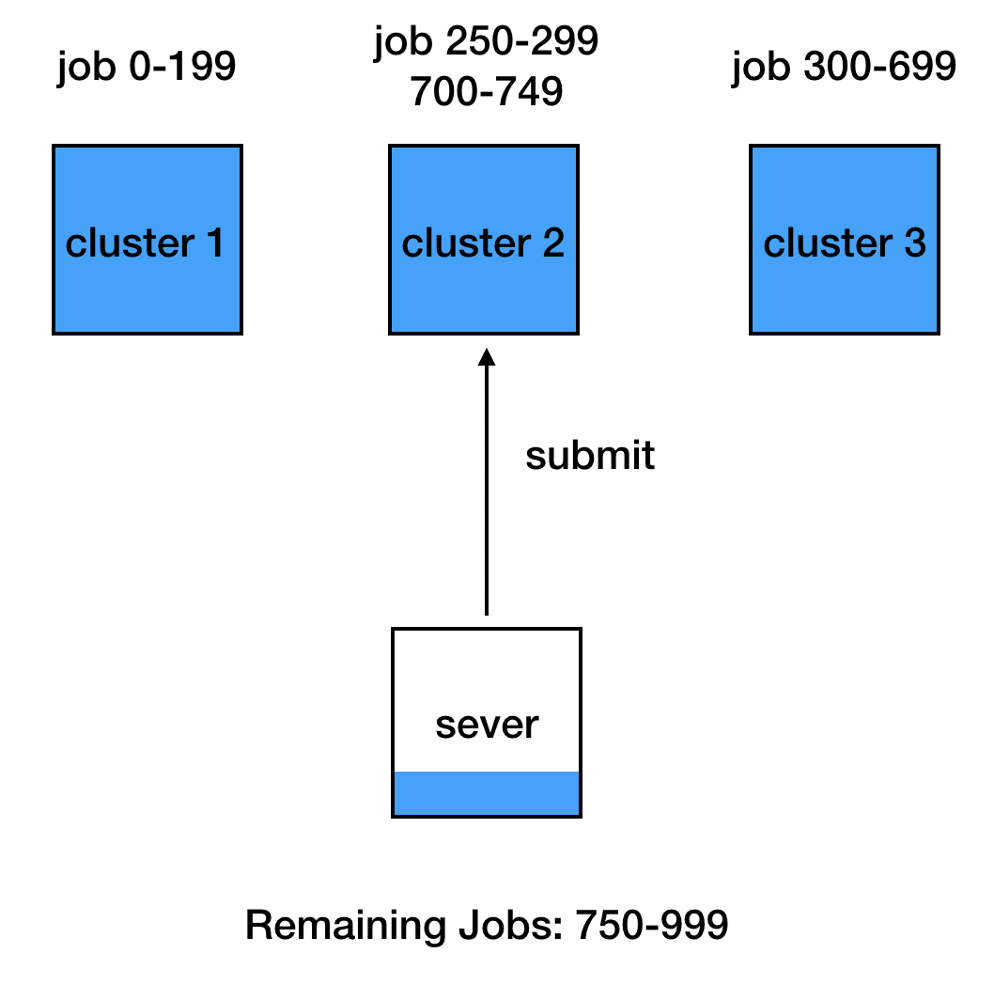

# AlphaEx
AlphaEx (Alpha Experiment) is a python toolkit that helps you run a large number of experiments easily and efficiently.

With AlphaEx, you can:
1. Run thousands of experiments on multiple computer clusters automatically, so that you can squeeze the most of your computation hardware.
2. Sweep experiment variables in a deadly simple effective way. Just define a json file and do your sweeps with one click.

The above 2 functions are implemented in 2 self-contained python scripts
`submitter.py`, `sweeper.py`.

**Warning**:

The sweeper can be used in any machine with python installed. But submitter
currently is only compatible with **slurm**. Make sure you have access to
at least one cluster which has slurm installed. For example, I
have an account on compute canada, so I can use clusters including
cedar, mp2, etc.

To test these 2 modules, run
`python test/test_submitter.py`, `python test/test_sweeper.py`
 (submitter needs to be configured first
with you own setting. Please refer to the next section.)

## Dependencies
1. python 3.7
2. numpy
2. matplotlib
3. json

## Submitter

### What is submitter
When you have 10000 jobs to run and 3 computer clusters to use.
It is not easy idea to manually assign jobs to clusters in a effective way.
One reason is each computer cluster has different performance.
Some may be faster than other. The other reason is each cluster may have
different restrictions on the number of jos submitted.
Submitter automatically submits all jobs for you in a simple way.

1. Connecting to all user-defined clusters.
<p></p>
2. Submit as many jobs as you want to each cluster (but not exceeding the max number of jobs allowed)
<p></p>
3. Periodically check if there are jobs finished
<p></p>
4. If there is any, submit same number of new jobs as the finished ones until all jobs are submitted.
<p></p>

### How to use submitter

#### Ssh Automation
To use submitter, you need to first have automatic ssh access to clusters from the server,
so that every time when you ssh to a cluster, just type in `ssh clustername`
without entering the full url, your username and password.

The next 3 steps help you do this. In your server's home directory:

1. `ssh-keygen`
2. `ssh-copy-id <username>@<cluster url>`
3. Add the cluster information in .ssh/config
```
Host *
    AddKeysToAgent yes
    IdentityFile ~/.ssh/id_rsa

Host <cluster nickname>
    HostName <cluster url>
    User <username>
```
Next time when you want to add a new cluster, just do step 2 and step 3.

#### An Example
Now you can use submitter. test/test_submitter.py is a good example to start with.

```
from alphaex.submitter import Submitter


def test_submitter():
    clusters = [
        {
            'name': 'mp2',
            'capacity': 200,
            'project_root_dir': '/home/yiwan/projects/def-sutton/yiwan/alphaex',
            'script_path': 'test/submit.sh'
        },
        {
            'name': 'cedar',
            'capacity': 100,
            'project_root_dir': '/home/yiwan/projects/def-sutton/yiwan/alphaex',
            'script_path': 'test/submit.sh'
        },
    ]
    submitter = Submitter(clusters, 1000)
    submitter.submit()


if __name__ == '__main__':
    test_submitter()
```

Submitter class instantiates with a list of dictionary and a integer. The list contains the information of
all clusters that you want to run your experiment on and the integer is the total number of jobs.

Each dictionary gives information of a cluster:

`name`: the nickname of your remote cluster, it should be defined in .ssh/config.

`capacity`: maximum number of jobs you want to run in that cluster, usually each cluster provides this information in its user manuel.

`project_root_dir`: the root directory for your project in the remote cluster

`script_path`: the path of the slurm array job submission script in the remote cluster.

Note that currently we only support array job submission in slurm, since this is the most effective way when you have large number of jobs.

`test/submit.sh` is an example of the array job submission script, please refer to the user manual of slurm if you don't understand the following script.

```
#!/bin/bash

#SBATCH --time=02:55:00
#SBATCH --mem-per-cpu=1G
#SBATCH --job-name submit.sh
#SBATCH --output=output/submit_%j.txt
#SBATCH --error=error/submit_%j.txt

export OMP_NUM_THREADS=1
mkdir -p output
mkdir -p error

sleep $((SLURM_ARRAY_TASK_ID / 10))
```

In this simple example, each job is just sleeping for some time. The sleeping time depends on the unique id of each job SLURM_ARRAY_TASK_ID.
This ID will be assigned by submitter automatically.

Now run `python test/test_submitter.py` in the server, it will automatically submit job 1-1000 to cluster mp2 and cedar for you.

In the above example, the total capacity of mp2 and cedar are less than the total number jobs you want to run. So submitter can not
submit all jobs to these two clusters at once.
Instead, it will submit array jobs with array indices 1-200 to cluster mp2, and submit array jobs 201-300 to cluster cedar.
After that, it will periodically check whether there is any submitted job finishes.
And if there is any, the submitter will submit same number of new jobs as the finished ones until all 1000 jobs are submitted.

### Tips
Since the server always needs keep running a program to monitor job status and submit new jobs.
It may not be a good idea to use user's own laptop as the server because the laptop might not always have the internet connection.
My suggestion is to use one cluster as the server and use program like screen to make
sure the monitor program runs in the background even if the user logout from the server.

## Sweeper
Using sweeper, you can sweep all experiment variables using one click. These
variables can be different algorithms, different simulators, different parameters etc.

All the variables and the way to store it is defined in a user-defined Json file. For example,
the following Js
To use sweeper, first define a Json file which specifies all the combinations of variables that you want to sweep over.
`cfg/variable.json` is an example:

```
{
    "experiments":
    [
        {
            "simulator": ["simulator_1"],
            "algorithm and parameters": [
                {
                    "algorithm": ["algorithm_1"],
                    "param1-2":
                    [
                        {
                            "param1": ["param1_1", "param1_2"],
                            "param2": [0.1, 0.2]
                        },
                        {
                            "param1": ["param1_3", "param1_4"],
                            "param2": [0.3, 0.4]
                        }
                    ],
                    "param3": [1, 2, 3]
                },

                {
                    "algorithm": ["algorithm_2"],
                    "param1":["param1_3", "param1_4"],
                    "param4": [true, false]
                }
            ]
        },
        {
            "simulator": ["simulator_2"],
            "algorithm and parameters": [
                {
                    "algorithm": ["algorithm_2"],
                    "param1":["param1_3", "param1_4"],
                    "param4": [true, false]
                },
                {
                    "algorithm": ["algorithm_3"],
                    "param5":["param5_1"],
                    "param6": [true]
                }
            ]
        }
    ]
}
```

**The general principle is: every parameter combination takes only one element from every list, and takes all elements from every dictionary.**

In our example, a legitimate combination of variables is

```
simulator: simulator_2
algorithm: algorithm_3
param1: None
param2: None
param3: None
param4: None
param5: param5_1
param6: True
```

Sweeper will generate all different combinations of variables. test/test_sweeper.py is an example of using it

```
from alphaex.sweeper import Sweeper
import logging
import os


def test_sweeper():
    cfg_dir = 'test/cfg'
    log_dir = 'test/log'
    sweep_file_name = 'param.json'
    param_sweeper = Sweeper(os.path.join(cfg_dir, sweep_file_name))
    for sweep_id in range(0, param_sweeper.total_combinations):
        rtn_dict = param_sweeper.parse(sweep_id)

        report = 'idx: %d \nparam1: %s \nparam2: %s\nparam3: %s\nparam4: %s \nparam5: %s\nparam6: %s\nparam7: %s \nparam8: %s\n' % (
            sweep_id,
            rtn_dict.get('param1', None),
            rtn_dict.get('param2', None),
            rtn_dict.get('param3', None),
            rtn_dict.get('param4', None),
            rtn_dict.get('param5', None),
            rtn_dict.get('param6', None),
            rtn_dict.get('param7', None),
            rtn_dict.get('param8', None),
        )
        print(report)
        logger = logging.getLogger(str(sweep_id))
        logger.setLevel(logging.INFO)
        if not os.path.exists(os.path.join(log_dir, sweep_file_name)):
            os.makedirs(os.path.join(log_dir, sweep_file_name))
        log_file_path = os.path.join(log_dir, sweep_file_name, str(sweep_id) + '.txt')
        if os.path.exists(log_file_path):
            os.remove(log_file_path)
        fh = logging.FileHandler(log_file_path)
        fh.setFormatter(logging.Formatter('%(asctime)s - %(name)s - %(levelname)s: %(message)s'))
        fh.setLevel(logging.INFO)
        logger.addHandler(fh)
        for _ in range(100):
            logger.info(report)
        fh.close()


if __name__ == '__main__':
	test_sweeper()

```

In the above example, an sweeper instantiation is initialized with the json file path
```
param_sweeper = Sweeper(os.path.join(cfg_dir, sweep_file_name))
```
The sweeper class has a method `parse`, which returns a dictionary containing a combination of variables given an sweep id.
Each combination has the unique sweep id.
```
rtn_dict = param_sweeper.parse(sweep_id)
```

## Acknowledgement
This project was inspired by Muhammad Zaheer's sweeper code.

##
Please use the bibtex if you want to cite this repo
```
@misc{alphaex,
  author = {Yi, Wan},
  title = {AlphaEx: A Python Toolkit for Managing Large Number of Experiments},
  year = {2019},
  publisher = {GitHub},
  journal = {GitHub Repository},
  howpublished = {\url{https://github.com/umichyiwan/AlphaEx}},
}
```

